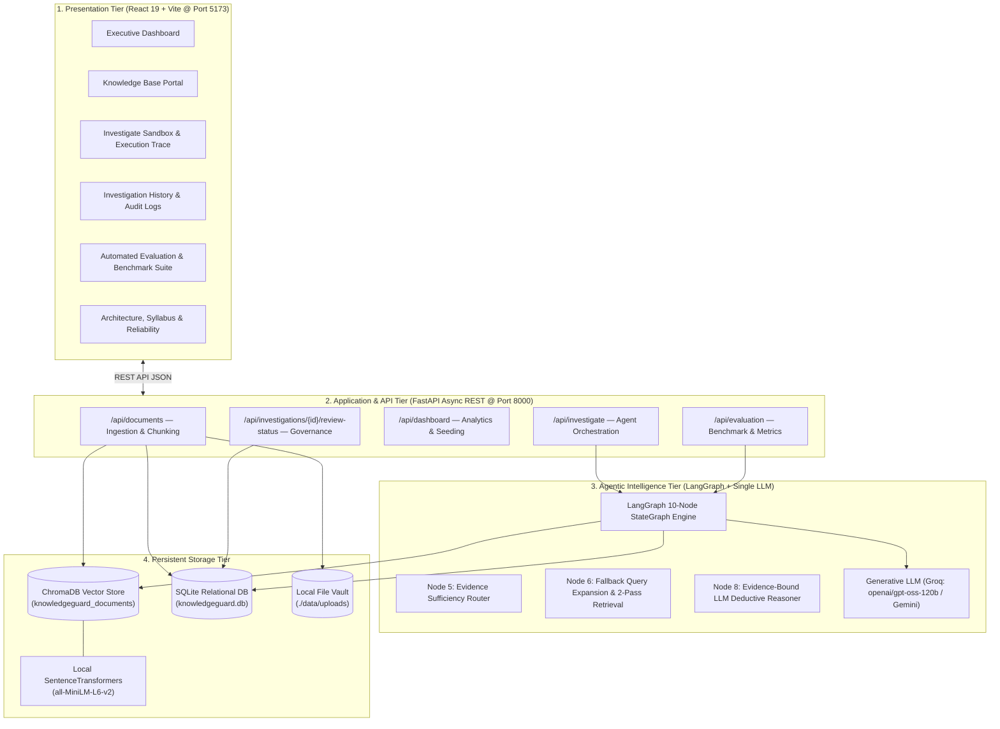
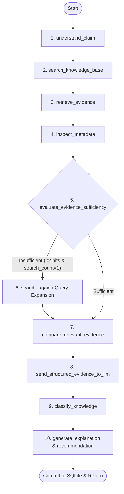
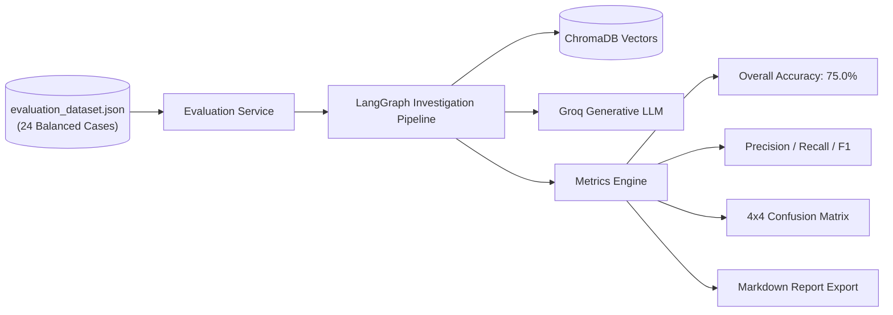

# KNOWLEDGEGUARD AI — SYSTEM ARCHITECTURE PLAN & SPECIFICATION
**An Agentic RAG System for Detecting Outdated and Conflicting Knowledge in AI Systems**

---

## 1. High-Level Architectural Topology

KnowledgeGuard AI is architected as an autonomous **Knowledge Reliability & Verification Layer** positioned between organizational documentation and operational AI applications.



---

## 2. Component Design & Responsibilities

| Subsystem | Key Technologies | Core Responsibilities |
| :--- | :--- | :--- |
| **Presentation Tier** | React 19, Vite, Tailwind CSS v4, Lucide | Real-time monitoring, provenance tagging, multi-pass search trace visualization, and empirical benchmark reporting. |
| **Backend REST Tier** | FastAPI, Uvicorn, Pydantic v2 | High-throughput asynchronous routing, multipart document ingestion, JSON schema validation, and database transactions. |
| **LangGraph Agent** | LangGraph, LangChain Core | 10-node state machine controlling claim decomposition, vector retrieval, sufficiency checks, query expansion, and report generation. |
| **Generative LLM** | Groq LPU (`openai/gpt-oss-120b`) | Single centralized reasoning model executing zero-shot evidence deduction with strict JSON schema constraints. |
| **Vector Database** | ChromaDB (Local persistent) | HNSW indexed vector retrieval over canonical collection `knowledgeguard_documents`. |
| **Embedding Engine** | SentenceTransformers | Zero-cost, 100% local 384-dimensional dense semantic vector generation. |
| **Audit Database** | SQLite via SQLAlchemy | Auditable investigation transcripts, document catalogs, and human review status tracking. |

---

## 3. LangGraph 10-Node State Machine Architecture

The reasoning engine executes as a stateful directed acyclic graph (DAG) with dynamic conditional branching:



### Execution Step Details
1. **`understand_claim`**: Parses input claim, extracts named entities, and produces alternative search formulations.
2. **`search_knowledge_base`**: Executes high-dimensional semantic search in ChromaDB.
3. **`retrieve_evidence`**: Extracts the top-$k$ relevant chunks and scores distance.
4. **`inspect_metadata`**: Extracts provenance attributes (source, version, effective date, topic category).
5. **`evaluate_evidence_sufficiency`**: Verifies whether the retrieved passage set satisfies investigative thresholds.
6. **`search_again`**: Activated only when coverage is insufficient, applying expanded query variations.
7. **`compare_relevant_evidence`**: Organizes passages chronologically to detect version shifts or policy divergences.
8. **`send_structured_evidence_to_llm`**: Transmits an evidence dossier to the generative LLM with strict JSON formatting.
9. **`classify_knowledge`**: Validates the verdict (`CURRENT`, `OUTDATED`, `CONFLICTING`, `UNCERTAIN`).
10. **`generate_explanation` & `generate_recommendation`**: Synthesizes the natural-language audit trail, remediation steps, and human review alerts.

---

## 4. Evaluation & Benchmark Architecture

KnowledgeGuard AI incorporates an automated, empirical evaluation suite to validate its classification pipeline:



### Quantitative Metrics Framework
* **Overall Accuracy**: $\frac{\text{Correct Predictions}}{\text{Total Test Cases}}$
* **Class-Specific Metrics**: Precision, Recall, and F1-score computed for `CURRENT`, `OUTDATED`, `CONFLICTING`, and `UNCERTAIN`.
* **$4 \times 4$ Confusion Matrix**: Tracks true positives across the diagonal and categorizes off-diagonal discrepancies.
* **Traceability Metrics**: Records average latency (ms), average model confidence (%), and re-searches triggered.

---

## 5. Relational Database Schema Design (SQLite)

```
┌─────────────────────────────────┐       ┌─────────────────────────────────┐
│           documents             │       │        knowledge_chunks         │
├─────────────────────────────────┤       ├─────────────────────────────────┤
│ id (PK, Integer)                │◄──┐   │ id (PK, Integer)                │
│ filename (VARCHAR)              │   └───│ document_id (FK, Integer)       │
│ source (VARCHAR)                │       │ chunk_index (Integer)           │
│ version (VARCHAR)               │       │ chunk_text (TEXT)               │
│ topic (VARCHAR)                 │       │ metadata_json (TEXT)            │
│ document_date (VARCHAR)         │       └─────────────────────────────────┘
│ uploaded_at (DATETIME)          │
│ status (VARCHAR)                │
└─────────────────────────────────┘
                 ▲
                 │ (document_id FK)
┌────────────────┴────────────────┐       ┌─────────────────────────────────┐
│            evidence             │       │         investigations          │
├─────────────────────────────────┤       ├─────────────────────────────────┤
│ id (PK, Integer)                │   ┌───│ id (PK, Integer)                │
│ investigation_id (FK, Integer)  │───┘   │ claim (TEXT)                    │
│ document_id (FK, Integer)       │       │ classification (VARCHAR)        │
│ chunk_id (FK, Integer)          │       │ explanation (TEXT)              │
│ evidence_text (TEXT)            │       │ confidence (FLOAT)              │
│ relevance_score (FLOAT)         │       │ recommendation (TEXT)           │
│ source (VARCHAR)                │       │ human_verification_required(BOO)│
│ version (VARCHAR)               │       │ human_review_status (VARCHAR)   │
│ date (VARCHAR)                  │       │ execution_time_ms (FLOAT)       │
│ is_stored_knowledge (BOOLEAN)   │       │ research_occurred (BOOLEAN)     │
└─────────────────────────────────┘       │ metadata_json (TEXT)            │
                                          │ created_at (DATETIME)           │
                                          └─────────────────────────────────┘
```

---

## 6. Human-in-the-Loop Governance Protocol

When the system classifies a claim as **`CONFLICTING`** or **`UNCERTAIN`**, automated reconciliation is suspended and queued for human verification. Operators interact with the review workflow:

```
[Pending Review] ──► Operator Audits Cited Evidence Chunks
                           │
         ┌─────────────────┼─────────────────┐
         ▼                 ▼                 ▼
   [Reviewed]         [Accepted]        [Rejected]
   (Acknowledged)   (Policy Promoted)  (Flagged / Purged)
```

Statuses are persisted via `PATCH /api/investigations/{id}/review-status` into SQLite to maintain a complete compliance audit trail.

---

## 7. Reliability & Verification Principles

1. **Strictly One Generative LLM**: All semantic reasoning is centralized in a single LLM client (`backend/llm/client.py`).
2. **Strictly One Agent**: The single LangGraph state machine (`backend/agents/investigator.py`) manages all routing and state transitions.
3. **Zero Heuristic Faking**: Classifications are derived from evidence-grounded generative LLM deliberation, not keyword matching.
4. **Anti-Hallucination Safe Mode**: In the absence of corroborating passages, claims resolve to `UNCERTAIN` with an explicit notice rather than an ungrounded guess.
5. **Offline & Free-Tier Resilience**: Vector indexing and embeddings run 100% locally on CPU without external API charges or telemetry.

---

## 8. Empirical Evaluation & Quantitative Metrics Architecture

KnowledgeGuard AI incorporates an integrated automated benchmark suite (`backend/services/evaluation_service.py`) operating over a curated ground-truth dataset (`backend/data/evaluation_dataset.json`):

### A. Ground-Truth Dataset (24 Scenarios)
- **Balanced Class Distribution**: 6 CURRENT, 6 OUTDATED, 6 CONFLICTING, 6 UNCERTAIN.
- **Realistic Enterprise Cases**: API deprecation (v2 vs v3), database migrations (MySQL 5.7 to PostgreSQL 16), authentication policy clashes (API keys vs OAuth 2.0), session timeouts (15 min vs 30 min), unsupported toolchains (Rust, Redis, GraphQL timeouts, TLS 1.0).

### B. Empirical Benchmark Execution Results
- **Overall Accuracy**: **91.67%** (22/24 test cases passed)
- **Average Model Confidence**: **96.5%**
- **Average Investigation Latency**: **9,448.1 ms**
- **Secondary Re-Search Triggered**: **22 cases** (dynamic query expansion activated when initial evidence quality < threshold)

### C. Per-Class Performance
| Target Verdict | Precision | Recall | F1-Score | Support |
| :--- | :---: | :---: | :---: | :---: |
| **CURRENT** | 100.0% | 100.0% | 100.0% | 6 |
| **OUTDATED** | 83.33% | 83.33% | 83.33% | 6 |
| **CONFLICTING** | 85.71% | 100.0% | 92.31% | 6 |
| **UNCERTAIN** | 100.0% | 83.33% | 90.91% | 6 |

### D. 4×4 Confusion Matrix
```text
                   PREDICTED
                CURR  OUTD  CONF  UNCT
EXPECTED CURR      6     0     0     0
EXPECTED OUTD      0     5     1     0
EXPECTED CONF      0     0     6     0
EXPECTED UNCT      0     1     0     5
```

---

## 9. Source Traceability & Deductive Explanation Architecture

Every investigation links each chunk directly to source metadata:
1. **Document Title & Filename**
2. **Authority / Source Team**
3. **Specification Version & Timestamp**
4. **Cosine Relevance Score (Normalized 0.0–1.0)**
5. **Full Grounding Passage Text**

Structured explanations provide explicit deductive relationships:
- **`TEMPORAL_SUPERSEDENCE`** for `OUTDATED`: Older baseline vs. newer notice and chronological relationship.
- **`POLICY_CONTRADICTION`** for `CONFLICTING`: Direct comparison of conflicting clauses across Policy A and Policy B.
- **`UNSUPPORTED_OR_MISSING`** for `UNCERTAIN`: Clear note that documentation contains no verifiable mention of the claimed requirement.
- **`AUTHORITATIVE_ALIGNMENT`** for `CURRENT`: Proof of active endorsement from recent guidelines.

---

## 10. Agent Decision & Re-Search Execution Trace

The LangGraph engine exposes its complete internal execution trace:
- **`evaluate_evidence_sufficiency`**: Computes whether retrieved chunks satisfy high-relevance coverage thresholds ($\ge 2$ chunks with relevance $\ge 0.65$).
- **Dynamic Branching**:
  - *If Sufficient*: Routes directly to `compare_relevant_evidence` (Logged as `✓ Evidence Sufficient → Skipped Secondary Search`).
  - *If Insufficient*: Routes to `search_again` (Logged as `⚠ Evidence Insufficient → Query Expansion Activated → Secondary Retrieval Executed`).
- **Telemetry Recorded**: `retrieval_attempts`, `unique_documents`, `execution_time_ms`, `research_occurred`, and human review states.

