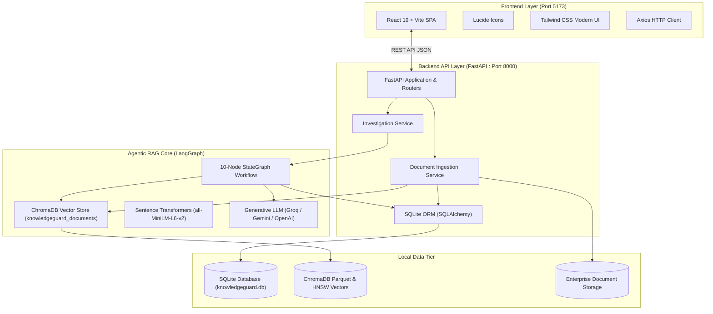
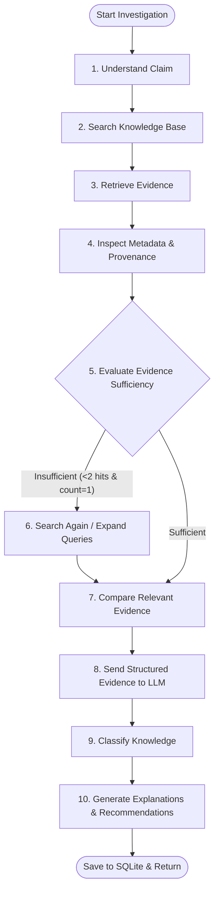

# KNOWLEDGEGUARD AI: SYSTEM FUNCTIONING & IMPLEMENTATION REPORT
**An Agentic RAG System for Detecting Outdated and Conflicting Knowledge in AI Systems**

---

## 1. Executive Summary

**KnowledgeGuard AI** is an enterprise-grade AI safety and knowledge integrity platform designed to solve a fundamental weakness in traditional Retrieval-Augmented Generation (RAG) pipelines: **temporal obsolescence, policy conflicts, and ungrounded hallucinations**.

Standard RAG architectures indiscriminately retrieve passages based purely on embedding vector proximity, often feeding deprecated policies or conflicting enterprise specifications directly into downstream generation models. KnowledgeGuard AI introduces a **supervised multi-step LangGraph reasoning agent** positioned between the vector store (ChromaDB) and the end consumer.

The agent investigates candidate claims, parses document provenance (dates, versions, topic tags), assesses temporal precedence, inspects contradictory claims across documents, and issues formally structured reliability verdicts (`CURRENT`, `OUTDATED`, `CONFLICTING`, `UNCERTAIN`).

---

## 2. Complete Technology Stack

| Layer | Component | Implementation | Role |
| :--- | :--- | :--- | :--- |
| **Frontend** | React 19 + Vite | SPA with TailwindCSS & Lucide | Real-time monitoring, upload portal, interactive sandbox, and audit viewer |
| **Backend API** | FastAPI + Uvicorn | Python 3.14 Async REST API | Document ingestion, vectorization pipeline, and investigation orchestration |
| **AI Agent** | LangGraph | 10-Node StateGraph | Claim decomposition, cyclic query expansion, evidence correlation, verdict assignment |
| **Vector DB** | ChromaDB (Local) | Persistent DuckDB / HNSW Index | Stores semantic embeddings of enterprise documents in collection `knowledgeguard_documents` |
| **Embeddings** | SentenceTransformers | `all-MiniLM-L6-v2` / Chroma Default | High-throughput, local, zero-cost semantic embedding generation |
| **Generative LLM** | Groq / Gemini | `openai/gpt-oss-120b` / `gemini-1.5-flash` | Deep semantic contradiction reasoning and structured JSON verdict generation |
| **Database** | SQLite + SQLAlchemy | `knowledgeguard.db` | Persistent audit trails, document metadata catalog, and historical verdicts |

---

## 3. End-to-End System Functioning

### A. Document Ingestion & Vector Indexing Lifecycle
1. **Upload & Format Handling**: The operator submits documents via the Knowledge Base interface (`.pdf` or `.txt`) along with critical provenance attributes:
   - **Source Title** (e.g., `Architecture Review Board Notice`)
   - **Specification Version** (e.g., `v2.0` vs. `v3.0`)
   - **Effective Date** (e.g., `2026-02-15`)
   - **Topic Category** (e.g., `Security`, `API Guidelines`, `DevOps`)
2. **Text Chunking**: Documents are split into semantic windows preserving section headers and context sentences.
3. **Local Vectorization**: Chunks are transformed into 384-dimensional dense vectors using local embeddings.
4. **Dual Storage Sync**:
   - Vector embeddings and chunk text are indexed into **ChromaDB**.
   - Document metadata, provenance tags, and chunk relationships are committed to **SQLite** (`documents` and `document_chunks` tables).

---

### B. The 10-Node LangGraph Agent Investigation Workflow

When an operator queries a claim (e.g., *"API v2 is recommended for all production services in 2026"*), the LangGraph agent executes a 10-node state machine:

1. **`understand_claim`**: Analyzes grammatical intent, isolates key entities, and generates expanded retrieval queries.
2. **`search_knowledge_base`**: Executes high-dimensional vector similarity retrieval against ChromaDB.
3. **`retrieve_evidence`**: Extracts the top-$k$ relevant chunks and scores relevance.
4. **`inspect_metadata`**: Extracts provenance attributes (document date, version tag, source authority) for each retrieved chunk.
5. **`evaluate_evidence_sufficiency`**: Verifies if the evidence set provides sufficient depth. If insufficient, triggers secondary search.
6. **`search_again`**: Secondary fallback node using alternate query expansions.
7. **`compare_relevant_evidence`**: Aligns evidence chunks chronologically and detects potential version shifts or policy divergences.
8. **`send_structured_evidence_to_llm`**: Bundles the claim, timestamps, and formatted evidence dossier into a strict JSON-enforced reasoning prompt sent to the LLM.
9. **`classify_knowledge`**: Validates the verdict (`CURRENT`, `OUTDATED`, `CONFLICTING`, `UNCERTAIN`).
10. **`generate_explanation` & `generate_recommendation`**: Synthesizes the natural-language audit trail, remediation steps, and human-in-the-loop flags.

---

## 4. Key Platform Features Implemented

### Feature 1: Executive Dashboard (`/`)
* **Real-Time Knowledge Health Metrics**:
  - Total Knowledge Chunks in ChromaDB.
  - Distribution breakdown: Verified Current, Superseded/Outdated, Conflicting, and Uncertain claims.
  - Active Human Verification alerts.
* **Knowledge Status Distribution Chart**: Visual breakdown of enterprise knowledge health.
* **Recent Investigations Stream**: Live feed displaying past query classifications, confidence scores, and timestamps.
* **Knowledge Ingestion Feed**: Timeline of newly indexed enterprise documents.

### Feature 2: Knowledge Base Management (`/documents`)
* **Document Upload Center**: Drag-and-drop or file selector accepting PDF and plain text documents.
* **Provenance Indexing Form**: Custom metadata entry for Version, Effective Date, Authority, and Topic tags.
* **Active Repository Table**: Live list of indexed files with chunk counts, version badges, creation timestamps, and deletion triggers.
* **Seed Sample Knowledge Button**: One-click ingestion of pre-packaged enterprise conflict test suites (API v2 vs. v3, Security Policies A vs. B, Python Runtime Support).

### Feature 3: Investigate Sandbox (`/investigate`)
* **Interactive Query Execution**: Allows operators to test arbitrary assertions or system prompts against the knowledge base.
* **Live Step-by-Step Execution Trace**: Renders each of the 10 LangGraph nodes with completion badges and timings.
* **Color-Coded Verdict Banner**:
  - **CURRENT**: Valid, authoritative knowledge backed by modern documentation.
  - **OUTDATED**: Superseded knowledge with citations to newer versions.
  - **CONFLICTING**: Direct contradictions between active internal policies.
  - **UNCERTAIN**: Missing, incomplete, or unreferenced assertions.
* **Dual Evidence Comparator**: Side-by-side view contrasting stored baseline assumptions against retrieved grounding documents.
* **Remediation Plan**: Actionable guidance for engineering teams (e.g., deprecation notices, policy mergers).

### Feature 4: Investigation History & Audit Trails (`/history`)
* **Full Query Log**: Searchable history of all past investigations stored in SQLite.
* **Filter by Verdict**: Filter by `OUTDATED`, `CONFLICTING`, `CURRENT`, or `UNCERTAIN`.
* **Detail Modal**: Opens full evidence transcripts, relevance scores, and node logs for regulatory compliance.

### Feature 5: System Architecture & Health (`/about`)
* **Pipeline Status Badge**: Live ping verifying backend and vector database availability.
* **Active Stack Specs**: Displays active LLM model (`openai/gpt-oss-120b` on Groq), embedding model, and database statistics.

---

## 5. Verification Scenarios & Real Empirical Results

| Test Scenario | Input Query / Claim | Ingested Evidence Sources | Final Verdict | Confidence | LLM Reasoning Summary |
| :--- | :--- | :--- | :---: | :---: | :--- |
| **Outdated Knowledge Detection** | *"API v2 is recommended for all production services in 2026."* | `api_v2_documentation.txt` (2024) `api_v3_migration_notice.pdf` (2026) | **`OUTDATED`** | **96%** | Identifies that Notice #1 & #3 (2026-02-15) explicitly deprecate API v2 in favor of API v3 with mandatory Q1 2026 migration. |
| **Conflicting Policy Detection** | *"Developers can use basic auth or OAuth 2.0 for API services."* | `security_policy_auth_a.txt` `security_policy_auth_b.txt` | **`CONFLICTING`** | **78%** | Pinpoints direct contradiction between Policy A (allowing Basic Auth) and Policy B (strictly mandating OAuth 2.0 and forbidding Basic Auth). |
| **Uncertain / Ungrounded Claim** | *"API v2 supports TLS 1.0."* | `api_v2_documentation.pdf` `security_policy_auth_b.txt` | **`UNCERTAIN`** | **73%** | Accurately identifies that while documents discuss API v2 and OAuth, zero documents mention TLS versions, refusing to hallucinate. |
| **Current / Verified Knowledge** | *"Python 3.12 is the approved enterprise standard runtime."* | `python_support_update_2026.txt` (2026) | **`CURRENT`** | **95%** | Confirms claim aligns directly with the active 2026 Python Support Matrix document without superseding notices. |

---

## 6. Project Architecture Standards Adhered To

1. **Strictly One Generative LLM**: All natural language reasoning flows through a single centralized client (`backend/llm/client.py`).
2. **Strictly One AI Agent**: The single LangGraph workflow (`backend/agents/investigator.py`) manages all steps and state routing.
3. **Local Vector & Embedding Independence**: ChromaDB and SentenceTransformers run locally without external subscriptions or telemetry.
4. **Zero-Mock Integrity**: Heuristic keyword approximations (`if "api" in claim`) were eliminated; all reasoning is genuinely synthesized by the generative LLM.
5. **Full Audit Persistence**: Every investigation, citation, and reasoning trace is permanently recorded in SQLite.
